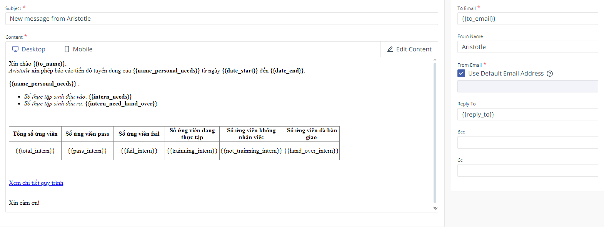
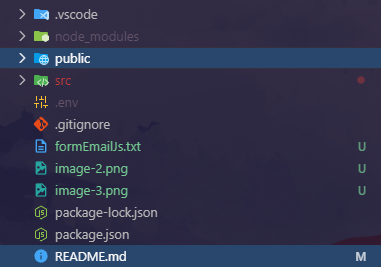

# Getting Started with Create React App

This project was bootstrapped with [Create React App](https://github.com/facebook/create-react-app).

## Available Scripts

### `config .env`
Open [link](https://dashboard.emailjs.com/sign-in), then sign in, if you doesn't have an account, sign up now. 
In sidebar:
 - Select 'Email service' -> click 'Add new service' -> choose gmail then select connect account and create service(in there have Service ID)
 - Select 'Email Templates' -> create new templates -> create templates, template like :

 main form: 

 Edit Content -> Code Editor code in Html (we have form template in formEmailJs.txt) :

Then you click apply changes -> save (take Template ID in settings).

 - You can take 'Public Key' in  Account. 

In project, create new file .env in project (file .env in big project) ex: 

import three variable: 

 - REACT_APP_API_SERVICE_ID = your Service ID
 - REACT_APP_API_TEMPLATE_ID = your Template ID 
 - REACT_APP_API_PUBLIC_KEY =  your Public Key
 
 Example: REACT_APP_API_SERVICE_ID = service_aswr1v7d

 Note: `if u changes some of ID or key, u must turn off your project and run again !!!`

### `npm install`
You must be run this to update package-lock.json before run start

### `npm start`

Runs the app in the development mode.\
Open [http://localhost:3000](http://localhost:3000) to view it in your browser.

The page will reload when you make changes.\
You may also see any lint errors in the console.

### `npm test`

Launches the test runner in the interactive watch mode.\
See the section about [running tests](https://facebook.github.io/create-react-app/docs/running-tests) for more information.

### `npm run build`

Builds the app for production to the `build` folder.\
It correctly bundles React in production mode and optimizes the build for the best performance.

The build is minified and the filenames include the hashes.\
Your app is ready to be deployed!

See the section about [deployment](https://facebook.github.io/create-react-app/docs/deployment) for more information.

### `npm run eject`

**Note: this is a one-way operation. Once you `eject`, you can't go back!**

If you aren't satisfied with the build tool and configuration choices, you can `eject` at any time. This command will remove the single build dependency from your project.

Instead, it will copy all the configuration files and the transitive dependencies (webpack, Babel, ESLint, etc) right into your project so you have full control over them. All of the commands except `eject` will still work, but they will point to the copied scripts so you can tweak them. At this point you're on your own.

You don't have to ever use `eject`. The curated feature set is suitable for small and middle deployments, and you shouldn't feel obligated to use this feature. However we understand that this tool wouldn't be useful if you couldn't customize it when you are ready for it.

